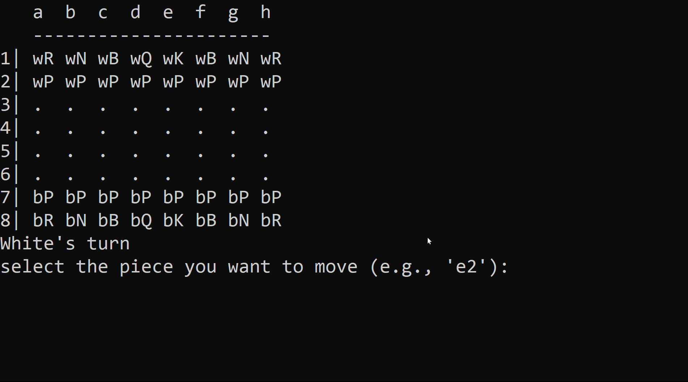
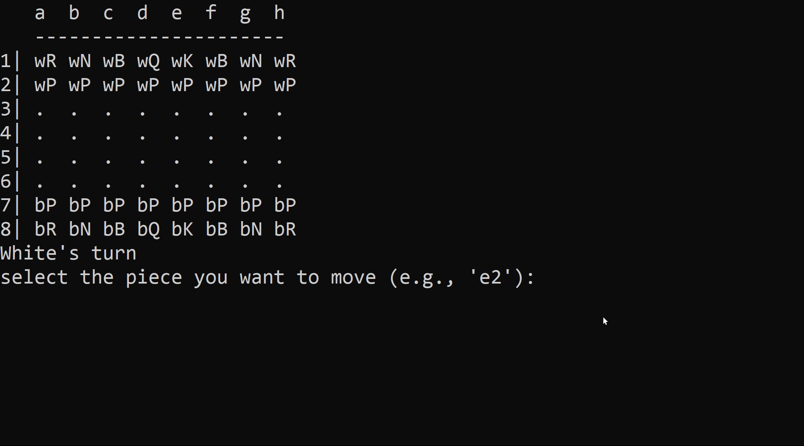
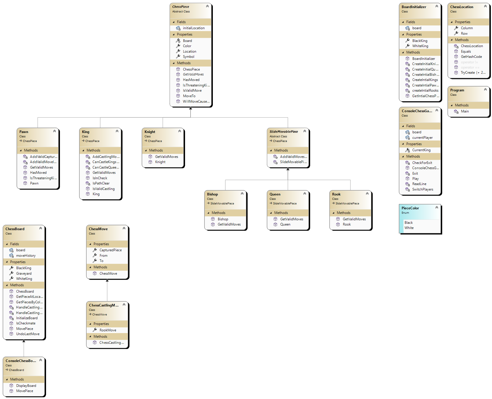

# chess_game

This is a simple chess engine implemented in C#. It supports various chess features and gameplay mechanics.

## Features

1. **Checkmate**: The engine detects and handles checkmate scenarios.
2. **Castling**: Castling moves are supported for both kingside and queenside.
3. **Pawn Promotion**: Pawns can be promoted to other pieces upon reaching the opposite end of the board.
4. **En Passant**: The en passant rule is implemented for capturing pawns.
5. **Undo Move**: Players can undo their last move.
6. **Check**: The engine can detect when a king is in check.
7. **Threefold Repetition**: The game can be drawn if the same position occurs three times.
8. **Insufficient Material**: The game can be drawn when there is insufficient material for checkmate.
9. **Impossibility of Checkmate**: The game can be drawn if checkmate is not possible.
10. **Move History**: The engine keeps a history of all moves made during the game.
11. **Graveyard**: Captured pieces are moved to the graveyard for reference.
12. **Check for Check**: A method is available to check if a move will cause a check on the king.
13. **Get Valid Moves**: A method is provided to get all valid moves for a piece.

## Object-Oriented Programming in the Chess Engine

1. **Encapsulation:**

   - ChessPiece Hierarchy: The project employs encapsulation by defining a hierarchy of chess pieces with a common base class `ChessPiece`. Each piece encapsulates its state, such as `Symbol`, `Color`, and `Location`.
   - Private Setters: Properties like `Symbol`, `Color`, and `Location` have private setters, ensuring controlled access and modification.

2. **Abstraction:**

   - Abstract Base Class: The `ChessPiece` class serves as an abstract base class, allowing for the creation of concrete classes like `Pawn`, `King`, etc. It abstracts common properties and methods shared among all chess pieces.

3. **Inheritance:**

   - Piece-Specific Classes: Inheritance is utilized to create specific chess piece classes (`Pawn`, `King`, etc.) that inherit common behavior from the `ChessPiece` base class. This promotes code reusability and a clear hierarchy.

4. **Polymorphism:**

   - Method Overriding: The `GetValidMoves` method is overridden in each concrete chess piece class, showcasing polymorphism. This allows for the same method name to exhibit different behaviors based on the specific piece type.

5. **Encapsulation for Chess Board:**

   - ChessBoard Class: The `ChessBoard` class encapsulates the board state, move history, and methods for moving pieces. It hides the complexity of the board implementation from external code.

6. **Composition:**

   - Piece Composition in BoardInitializer: The `BoardInitializer` class composes the initial chess pieces by creating instances of various piece classes and placing them on the chessboard.

7. **Private Constructors:**

   - Private ChessLocation Constructor: The `ChessLocation` class has a private constructor, and instance creation is controlled through the static method `TryCreate`. This ensures valid instances are created and enforces constraints.

8. **Operator Overloading:**

   - Equality Operators: The `==` and `!=` operators are overloaded for `ChessLocation` to enable convenient comparison between locations.

9. **Static Methods:**

   - ChessLocation Static Methods: The `TryCreate` static methods in `ChessLocation` showcase the use of static methods for creating instances based on different input formats.

10. **Single Responsibility Principle (SRP):**

    - Move Validation in Pieces: Each chess piece class is responsible for validating its own moves, adhering to the SRP. This makes the code more modular and maintainable.

11. **Dependency Injection:**

    - ChessBoard Dependency: Pieces receive a reference to the `ChessBoard` instance in their constructors. This promotes loose coupling and allows pieces to interact with the board.

12. **Method Overloading:**

    - Multiple `TryCreate` Methods: The `ChessLocation` class demonstrates method overloading with multiple `TryCreate` methods, each catering to different input types.

13. **Use of Enum:**

    - PieceColor Enum: Enum `PieceColor` is used to represent the color of chess pieces, improving code readability and eliminating the use of magic strings or numbers.

14. **Information Hiding:**

    - Private Setters, Private Constructors: The use of private setters, private constructors, and internal methods encapsulates implementation details, allowing changes without affecting external code.

15. **Immutable Objects:**
    - Immutable ChessLocation: The `ChessLocation` class, once created, is immutable. Ensuring that its state cannot be modified externally enhances predictability and reduces bugs.

## Future Enhancements:

The project is designed with an open-close architecture, providing a foundation for future enhancements. Consider expanding the class structure to support alternative user interfaces, allowing the chess engine to interact with different UI platforms seamlessly.
